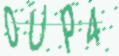

# pytorch实现验证码识别

### 前期准备

- 装上pytorch的cpu和GPU版本

### 项目目的

使用`pytorch`训练一个深度学习的模型来实现验证码的自动识别，其中验证码由`python`包`cpatcha`生成，其样子如下：

### 数据生成

我使用captcha生成了训练集和测试集，其中训练集包含大约100万张图片，测试集包含一千张图片，生成代码参考`generate_captcha.py`：
图片大小为，宽：(100,140)之间，高：(45,65)之间
### 网络模型

使用ResNet进行改进模型,具体参考`model.py`
在ResNet下，正确率可以超过90%。

### 使用方法

- python main.py 可以对模型进行训练
- python test.py 可以对单一图片进行识别
- python generate_captcha.py 可以生成自定义数量的验证码图片